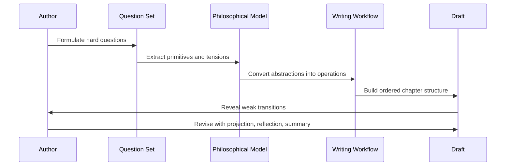

> Warning
> This file is machine-parsed by ROCode for autoresearch.
> Do not rename section headings.
> Do not reorder sections.
> Do not replace YAML blocks with plain text.
> If the format changes, autoresearch compilation may fail.

## Goal
Produce or improve `manuscript/book-chapter.md` as a chapter draft of at least 4500 characters. The chapter must contain a `Questions` section with at least 8 substantial questions, a `Philosophical Decomposition and Abstraction` section, a `Technical Workflow` section that turns abstractions into concrete writing operations, at least 2 Mermaid diagrams of different types, an `Imaginative Projection` section, a `Reflection` section, and a `Summary` section. The diagrams must help the reader think, not merely decorate the page.

## Scope
- manuscript/**
- notes/**
- references/**
- docs/examples/autoresearch_example/**

## Exclude
- target/**
- dist/**
- node_modules/**
- manuscript/archive/**

## Metric
```yaml
direction: higher-is-better
kind: numeric-extract
pattern: score=([0-9]+)
```

## Iteration Policy
```yaml
mode: bounded
max_iterations: 6
stuck_threshold: 2
```

## Decision Policy
```yaml
baseline_strategy: capture-before-first-iteration
keep_conditions:
  - metric-improved
  - verify-passed
discard_conditions:
  - metric-regressed
  - metric-unchanged
  - verify-failed
crash_retry_max_attempts: 2
```

## Context Markdown
Write as if this chapter will teach readers how to move from raw confusion to disciplined construction. The document should feel like a real book chapter, not a task note.

### Chapter Contract
- Begin with hard, explicit questions.
- Decompose the problem philosophically before prescribing method.
- Translate abstractions into a technical workflow with checkpoints.
- Use multiple Mermaid diagram types.
- Push the argument forward with imaginative projection.
- Re-open the argument with reflection.
- Close cleanly with summary.

### Recommended Chapter Outline
1. Questions
2. Philosophical Decomposition and Abstraction
3. Technical Workflow
4. Diagrammatic Models
5. Imaginative Projection
6. Reflection
7. Summary

### What The Questions Should Do
The `Questions` section should not be rhetorical filler. It should expose pressure points such as: What is the real unit of thought in a book chapter? When does abstraction clarify and when does it anesthetize? How do we know a workflow still preserves the live tension of the original question?

### What The Philosophical Decomposition Should Do
Break the writing problem into primitives such as attention, sequence, contrast, point of view, evidence, and transformation. Move from surface topic to deeper organizing oppositions. Show how the chapter's apparent topic is also a problem of framing and method.

### What The Technical Workflow Should Do
Convert abstractions into an actionable pipeline: collect tensions, cluster them, derive an outline, choose explanatory sequence, insert diagrams where cognition needs compression, then revise for continuity and argumentative pressure.

### Example Structural Map


### Example Editorial Interaction


### Imaginative Projection
Ask what the current argument would look like if extended into the future. Imagine downstream consequences, altered readers, stronger objections, and richer applications. The projection should intensify the chapter, not drift into fantasy.

### Reflection
Use reflection to identify what the chapter still cannot explain, where the framing may have overfit the material, and what conceptual residue remains unresolved.

### Summary
End with compression. The summary should not merely repeat headings. It should restate what changed in the reader's model of the problem after moving through questions, abstractions, workflow, diagrams, projection, and reflection.
